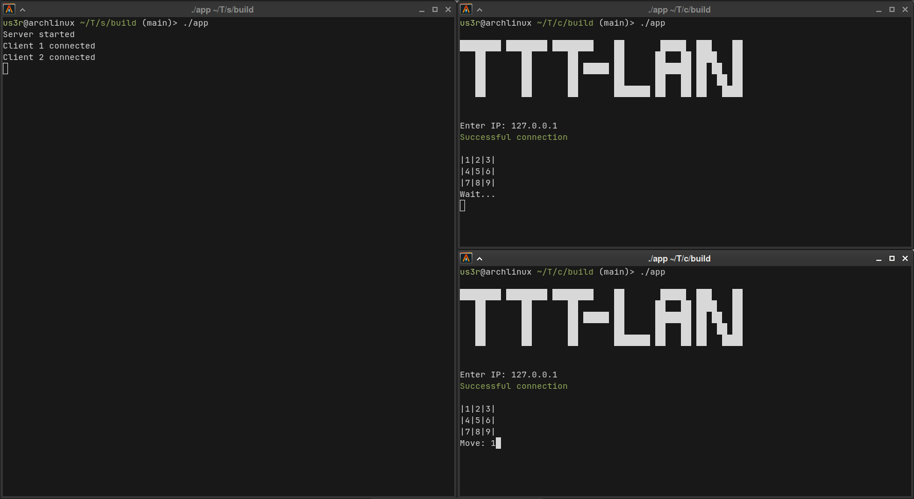

# TicTacToeLAN

Tic-Tac-Toe over Local Network in C++ using Boost.asio (terminal-based)

## How to run:

1. Start the server (it can run on a separate computer or on one of the players’ computers).
2. Both players start the client on their computers and enter the IP address of the device running the server.
3. After connecting, players can start the game; the first player to connect goes first (X).

**Note:** All devices must be connected to the same local network.

---

### Screenshot

# Крестики-нолики по локальной сети

Игра крестики-нолики по локальной сети, терминальная, реализованная на C++ с использованием библиотеки Boost.asio

## Запуск:
1. Запускается сервер (его можно запустить на отдельном компьютере либо на компьютере одного из игроков).
2. Оба игрока запускают клиент на своих компьютерах и вводят IP-адрес устройства, на котором запущен сервер.
3. После подключения игроки могут начать игру; первый подключившийся игрок делает первый ход (X).

**Примечание:** Все устройства должны быть подключены к одной локальной сети.
